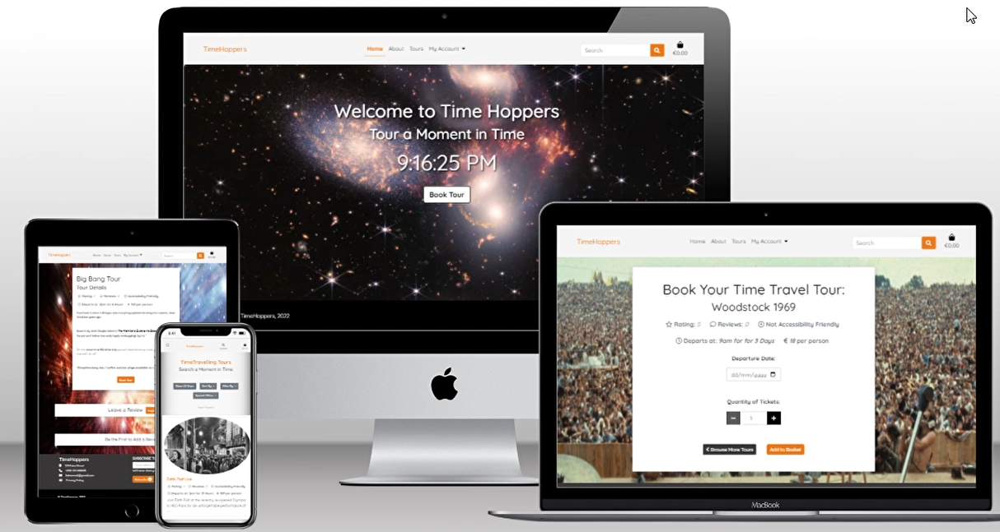

Project 5 README

# **Time Hoppers**

## Overview

Time Hoppers is a website for a fictitious time travelling tour guide company.  This site allows people to view, book and purchase tours on offer from different eras in time.  While this is a fictisious site the logic and design can be used for any kind of tour booking online payment company.

This site alows users to search for a specific tour or filter the tour by certain categories, they can read reviews, details and ratings of tours, and set up a profile where they can view their purchase history, save their contact information, upload a profile image and post reviews.

There is also the option to enter an email to subscribe to the newsletter.

Users can make online purchases either as a guest or logged in.  Once payment is successful, the user is sent an email confirmation of their purchase and their order number which is their booking ticket.

Site admin users can add, update and delete tours.  Site admin users can also create newsletters and email these newletters to all subscribers.

View the live project [Here]( https://time-hoppers.herokuapp.com/)

## User Experience (UX)

### User Stories

* As a Customer, I want to be able to choose the date of my tour boking so that I can book a tour that suits my time schedule

* As a Customer, I want to be able to select the quantity so that I can choose how many tickets of that tour I would like to buy

* As a Customer, I want to be able to review my order before making the final payment so that I can make sure I have not made any mistakes

* As a Customer, I want to be able to easily find my shopping cart so that I can view the items I have selected to buy

* As a Customer, I want to be able to edit my shopping cart so that I can adjust the quantity or remove items before purchasing

* As a Customer, I want to be able to see all tour guides and their contact details so that I can contact my tour guide when needed

* As a Customer, I want to be able to receive an email confirmation after paying so that I can be confident my payment and order was successful

* As a Customer, I want to be able to enter my payment details so that I can purchase my selected tour tickets

* As a Site User, I want to be able to navigate easily around the site so that I can find where I am and where I want to go.

* As a Site User, I want to be able to understand when an error occurs so that I can be given clear feedback on what I should do 

* As a Site User, I want to be able to go to navigate between pages on tour list view and comments so that I do not have to scroll for too long and easily navigate and find what I am looking for.

* As a Site User, I want to be able to sign up and receive an email so that I can be notified on any promotions or sales

* As a Site User, I want to be able to navigate easily to a list of tours so that I can select something to buy

* As a Site User, I want to be able to view tours by category so that I can filter out the products that don't meet my needs

* As a Site User, I want to be able to search for a specific tour so that I can identify quickly the tour I am specifically looking for

* As a Site User, I want to be able to view the details of each tour so that I can identify the price, description of tour, ratings, and reviews before deciding to purchase.

* As a First-Time User, I want to be able to easily register for an account so that I can have an account set up

* As a First-Time User I want to be able to understand why I need to register for an account so that I can decide if I wish to set up an account or continue as a guest

* As a First-Time User, I want to be able to understand the purpose of the site so that I can decide if I would like to use the site

* As a Registered User, I want to be able to receive an email so that I can verify my account has been created successfully

* As a Registered User I want to be able to return back to the page I was on after login in so that I can continue adding reviews etc without having to navigate back to that page after logging in

* As a Registered User, I want to be able to view my Profile so that I can view my order history and update my details

* As a Registered User, I want to be able to add a review or comment so that I can let other customers know what I thought of the product

* As a Registered User, I want to be able to log in and out of my account so that I can access my details and keep them secure

* As an owner I want to be able to have a link from the main site on login so that I can access the admin site

* As an owner I want to be able to have a link from the main site on login so that I can update, delete & add tours from the frontend

* As an owner I want to be able to have an update and delete button on each tour detail page so that I can update & delete the selected tours from the frontend

* As an owner I want to be able to have a link from the main site on login so that I can create & send a newsletter to all subscribers

### Agile Approach in this Project

An Agile Approach was used to develop this site.  That is, each activity was broken down into small bite-sized portions and performed iteratively, so that as it was repeated, it was tweaked and improved on with each cycle.  According to a report from the [Standish Group (2018)](https://standishgroup.myshopify.com/), Agile projects are statistically twice more likely to succeed, and a third less likely to fail than waterfall projects.

To complete the overall aim of the Time Hoppers idea, Epics were formed (documented under GitHub Issues) and these then were broken down into specific tasks called User Stories.  These User Stories are small, self-contained units of development work designed to accomplish a specific goal.  These User Stories then had acceptance criteria attached for each so that it was clear when the User Stories were achieved as each of these conditions were met.  The acceptance criteria where then further broken down into tasks.  These tasks were the list of actions required to implement the User Story. They described the technical work details and activities to be performed to complete each User Story properly.

**Example:**

    **Epic - User Account**

    User Story - Profile Page:
    
    As a User, I would like to be able to easily view my profile page so that I can view my order history, update my account details from there and choose an image others can see when I add a review.
    
    Acceptance Criteria 1
    Given that I am a registered user who is logged in
    When I click the Profile link in the navigation bar
    Then I am taken to my profile page and can see my details displayed
    
    Acceptance Criteria 2
    Given that I am a registered user who is logged in
    When I navigate to my profile page and edit my details
    Then I can click an update button and be alerted that my information was updated successfully.

    Acceptance Criteria 3
    Given that I am a registered user who is logged in
    When I navigate to my profile page and save my details
    Then I can see everytime I go to the order form that my details are prepopulated from my profile page.

    Acceptance Criteria 4
    Given that I am a registered user who is logged in
    When I navigate to my profile page and upload an image
    Then I can see my image displayed on my profile page and when I post a review.

    Acceptance Criteria 5
    Given that I am a registered user who is logged in
    When I navigate to my profile page
    Then I can see my order history and the details of each booking purchased.

Tasks:
*	create a profile app for users’ functionality
*	create signal to create a user profile when a new user signs up
*	link up views & templates & URLs and display link to profile page in nav after user is logged in
*	display logged in users name on the profile page
*	create a profile model to add profile picture, contact details such as email
*	create form to allow users to be able to edit the information displayed on their profile page
*	add update button for users to click to submit their changes
*	show success message when user profile update
*   add view to prepopulate the order form with the profile details information
*   display order history in table format on profile page, to be automatically updated after every order
*   manually test this works by setting up a test user

Story points estimated the effort required to complete a particular User Story in one iteration.  To create a Product Backlog GitHub Milestones was used to track progress on groups of issues relating to the User Stories.

Timeboxing defined the iteration where the User Stories were developed based on the assigned priority.  The MoSCoW Prioritization technique was used to assign priorities for Product Backlog Items to be completed in a particular time box.  GitHub Labels was used to categories the User Stories into Must Have, Should Have and Could Have. This clearly showed which User Stories were more important to implement first and in what order.  This kept the scope of the project in focus at all times and only implemented what was essential first.

Information radiators in Agile show real-time, informative and straightforward work status.  This project used a Kaban board, which was set up in GitHub Projects ([here]() to help keep track of work to do, in progress and completed.

Within the timeframe work stopped with X of the timebox User Story points total of all Must Have and some Should Have prioritised User Stories.  Any left uncompleted and are documented in the future features section below.

## Features

**This website takes the users stories mentioned above into consideration to create a positive UX.  The users stories are discussed in more detail below with examples of how each is implemented.**

1. **Favicon**

2. **Header**

*   Logo

*   Navigation Bar

3. **Landing Page**

4. **About Us**

5. **Tour List View**

6. **Tour Detail View**

7. **Register, Sign In & Log Out**

8. **Profile Page**

9. **Booking a Tour**

10. **Payment**

11. **Creating a Review**

12. **Updating & Deleting a Review**

13. **Updating & Deleting a Review**

14. **Ratings**

15. **Searching & Filtering**

16. **Admin User**

A super user was created to allow access to the admin section of the website.

17. **Footer**
        
18. **Error Pages**

Custom Error Pages were created to support the professionalism design and ensure appropriate link was added back to the main site to guide users who come across these messages.

* 400 Bad Request - the server cannot process the request due to something that is perceived to be a user error (it may be incorrect or corrupt).
* 403 Page Forbidden - the user does not have permission to access this resource
* 404 Page Not Found - the user requested a page that is not available
* 500 Server Error - internal server error where there is a general problem with the website's server and not the fault of the user

### Features Left to Implement

## Design

### Data Model

[LucidCharts](www.lucidchart.com) was used to visualise the custom models for this project.  [AllAuth](https://django-allauth.readthedocs.io/en/latest/) was also used for the user authentication system.  This uses the built-in Django User Model.

### Wireframes

After the design of the models [Balsamic Wireframes](www.balsamiq.com) were created to visualise the content the user sees and to design a positive UX (as described in more detail in the Features section).  A mobile first approach was used to design the site specifically for mobile use and then the design was altered slightly for desktop view.  [Bootstrap 5](https://getbootstrap.com/docs/5.0/getting-started/introduction/) was used with some customised styling to create a unique feel to the site.  [Font Awesome](https://fontawesome.com/) Icons were used throughout the site for reading accessibility also.

### Fonts
Fonts were imported from [Google Fonts](https://fonts.google.com/).

### Colour Scheme

The colour scheme was chosen by using [Coolors](https://coolors.co/). The following palette was chosen for using on the fonts throughout the site due to high contrast for user reading accessibility:

## Testing

### Validator Testing

### Interesting Bugs & Issues

## Security

All SECRET access keys are stored safely in env.py file to prevent unwanted connections to the database and this was set up before the first push to Github.

Django’s setting DEBUG was set to False after development for deployment to prevent access to error screens revealing code or database entries.

Django allauth was used to set up user registration and Django’s LoginRequiredMixin and UserPassesTestMixin were used to ensure only signed in users and authors can edit / delete their own posts or comments etc.

Cross-Site Request Forgery (CSRF) tokens were used on all forms throughout this site to prevent valid requests to the backend server being created for malicious purposes.

## Technologies Used

*   Languages:
    *   Python: used to develop the server-side
    *   HTML: the markup language used to create the web pages
    *   CSS: the styling language used to add custom styling

*   Frameworks and libraries:
    *   Django: python framework used to create all the backend logic
    *   Bootstrap5: CSS Framework for developing responsiveness and mobile-first
    *   Django-allauth: authentication library used to create the user accounts

*   Databases:
    *   SQLite: used as the database during development
    *   PostgreSQL: the database used to store all the data on deployment

*   Other tools:
    *   Balsamiq Wireframes: used to create the wireframes for design
    *   Chrome DevTools: used to debug the website
    *   Crispy Forms: used to manage Django Forms
    *   AWS: the image hosting service used to upload images
    *   Coolors: used to make the colour palette
    *   Font Awesome: used to create the icons
    *   Github Projects: used to track the progress of the project
    *   Git: the version control system
    *   GitHub: used to host the source code
    *   GitPod: the IDE used
    *   Heroku: the hosting service
    *   LucidCharts: used to create the ERD data model design
    *   Microsoft Paint 3D: used to create and manipulate images
    *   Pip3: the package manager used to install the dependencies
    *   Psycopg2: the database driver used to connect to the database
## Deployment

The site was deployed via Heroku.
1.  Log in to Heroku or create an account if required.
2.  Then, click the button labelled New from the dashboard in the top right corner and from the drop-down menu select Create New App.  You must enter a unique app name
3.  Next, select your region.
4.  Click on the Create App button.
5.  In your app go to Resources tab and add a Heroku Postgres database.
6.  The next page you will see is the project’s Deploy Tab. Click on the Settings Tab and scroll down to Config Vars and enter:
    *   DATABASE_URL = the URL of your heroku postgres database
    *   SECRET_KEY = a secret key for your app.
    *   PORT = 8000
    *   DISABLE_COLLECTSTATIC = 1 during development and remove when deploying to production

7.  Scroll to the top of the page and now choose the Deploy tab.
8.  Select Github as the deployment method.
9.  Confirm you want to connect to GitHub.
10. Search for the repository name and click the connect button.
11. Scroll to the bottom of the deploy page and select preferred deployment type:
12. Click either Enable Automatic Deploys for automatic deployment when you push updates to Github.
13. Select the correct branch for deployment from the drop-down menu and click Deploy Branch for manual deployment.

NB: Ensure in Django settings, DEBUG is False, create a Procfile and save database and secret key to env.py.

### Version Control

Git was used as the version control software. Commands such as git add ., git status, git commit and git push were used to add, save, stage and push the code to the GitHub repository where the source code is stored.

### Cloning

To clone this repository from GitHub to a local computer to make it easier to fix merge conflicts, add or remove files, and push larger commits or contribute use the following steps:

1.  On GitHub, navigate to the main page of the repository.

2.  Above the list of files, click Code.

3.  Click Use GitHub CLI, then the copy icon.

4.  Open Git Bash and change the current working directory to the location where you want the cloned directory.

5.  Type git clone, and then paste the URL that was copied from step 3 above.

6. Press Enter to create the local clone.

### Forking
A fork is a copy of a repository. Forking a repository allows you to freely experiment with changes without affecting the original project.

To fork this project, go to the top left of the repository, where you see the Fork Icon and click Fork.  This will create a copy of the repository for you.

## Credits
### Content

## Acknowledgements

