Project 5 README

# **Time Hoppers**

## Overview

Time Hoppers is a website for a fictitious time travelling tour guide company.  This site allows people to view, book and purchase tours on offer from different eras in time.  While this is a fictisious site the logic and design can be used for any kind of tour booking online payment company.

This site alows users to search for a specific tour or filter the tour by certain categories, they can read reviews, details and ratings of tours, and set up a profile where they can view their purchase history, save their contact information, upload a profile image and post reviews.

There is also the option to enter an email to subscribe to the newsletter.

Users can make online purchases either as a guest or logged in.  Once payment is successful, the user is sent an email confirmation of their purchase and their order number which is their booking ticket.

Site admin users can add, update and delete tours.  Site admin users can also create newsletters and email these newletters to all subscribers.

View the live project [Here]( https://time-hoppers.herokuapp.com/)

## User Experience (UX)

### User Stories

* As a Customer, I want to be able to choose the date of my tour boking so that I can book a tour that suits my time schedule

* As a Customer, I want to be able to select the quantity so that I can choose how many tickets of that tour I would like to buy

* As a Customer, I want to be able to review my order before making the final payment so that I can make sure I have not made any mistakes

* As a Customer, I want to be able to easily find my shopping cart so that I can view the items I have selected to buy

* As a Customer, I want to be able to edit my shopping cart so that I can adjust the quantity or remove items before purchasing

* As a Customer, I want to be able to see all tour guides and their contact details so that I can contact my tour guide when needed

* As a Customer, I want to be able to receive an email confirmation after paying so that I can be confident my payment and order was successful

* As a Customer, I want to be able to enter my payment details so that I can purchase my selected tour tickets

* As a Site User, I want to be able to navigate easily around the site so that I can find where I am and where I want to go.

* As a Site User, I want to be able to understand when an error occurs so that I can be given clear feedback on what I should do 

* As a Site User, I want to be able to go to navigate between pages on tour list view and comments so that I do not have to scroll for too long and easily navigate and find what I am looking for.

* As a Site User, I want to be able to sign up and receive an email so that I can be notified on any promotions or sales

* As a Site User, I want to be able to navigate easily to a list of tours so that I can select something to buy

* As a Site User, I want to be able to view tours by category so that I can filter out the products that don't meet my needs

* As a Site User, I want to be able to search for a specific tour so that I can identify quickly the tour I am specifically looking for

* As a Site User, I want to be able to view the details of each tour so that I can identify the price, description of tour, ratings, and reviews before deciding to purchase.

* As a First-Time User, I want to be able to easily register for an account so that I can have an account set up

* As a First-Time User I want to be able to understand why I need to register for an account so that I can decide if I wish to set up an account or continue as a guest

* As a First-Time User, I want to be able to understand the purpose of the site so that I can decide if I would like to use the site

* As a Registered User, I want to be able to receive an email so that I can verify my account has been created successfully

* As a Registered User I want to be able to return back to the page I was on after login in so that I can continue adding reviews etc without having to navigate back to that page after logging in

* As a Registered User, I want to be able to view my Profile so that I can view my order history and update my details

* As a Registered User, I want to be able to add a review or comment so that I can let other customers know what I thought of the product

* As a Registered User, I want to be able to log in and out of my account so that I can access my details and keep them secure

* As an owner I want to be able to have a link from the main site on login so that I can access the admin site

* As an owner I want to be able to have a link from the main site on login so that I can update, delete & add tours from the frontend

* As an owner I want to be able to have an update and delete button on each tour detail page so that I can update & delete the selected tours from the frontend

* As an owner I want to be able to have a link from the main site on login so that I can create & send a newsletter to all subscribers

### Agile Approach in this Project

An Agile Approach was used to develop this site.  That is, each activity was broken down into small bite-sized portions and performed iteratively, so that as it was repeated, it was tweaked and improved on with each cycle.  According to a report from the [Standish Group (2018)](https://standishgroup.myshopify.com/), Agile projects are statistically twice more likely to succeed, and a third less likely to fail than waterfall projects.

To complete the overall aim of the Time Hoppers idea, Epics were formed (documented under GitHub Issues) and these then were broken down into specific tasks called User Stories.  These User Stories are small, self-contained units of development work designed to accomplish a specific goal.  These User Stories then had acceptance criteria attached for each so that it was clear when the User Stories were achieved as each of these conditions were met.  The acceptance criteria where then further broken down into tasks.  These tasks were the list of actions required to implement the User Story. They described the technical work details and activities to be performed to complete each User Story properly.

**Example:**

    **Epic - User Account**

    User Story - Profile Page:
    
    As a User, I would like to be able to easily view my profile page so that I can view my order history, update my account details from there and choose an image others can see when I add a review.
    
    Acceptance Criteria 1
    Given that I am a registered user who is logged in
    When I click the Profile link in the navigation bar
    Then I am taken to my profile page and can see my details displayed
    
    Acceptance Criteria 2
    Given that I am a registered user who is logged in
    When I navigate to my profile page and edit my details
    Then I can click an update button and be alerted that my information was updated successfully.

    Acceptance Criteria 3
    Given that I am a registered user who is logged in
    When I navigate to my profile page and save my details
    Then I can see everytime I go to the order form that my details are prepopulated from my profile page.

    Acceptance Criteria 4
    Given that I am a registered user who is logged in
    When I navigate to my profile page and upload an image
    Then I can see my image displayed on my profile page and when I post a review.

    Acceptance Criteria 5
    Given that I am a registered user who is logged in
    When I navigate to my profile page
    Then I can see my order history and the details of each booking purchased.
    
    Tasks:
    * create a profile app for users’ functionality
    * create signal to create a user profile when a new user signs up
    * link up views & templates & URLs and display link to profile page in nav after user is logged in
    * display logged in users name on the profile page
    * create a profile model to add profile picture, contact details such as email
    * create form to allow users to be able to edit the information displayed on their profile page
    * add update button for users to click to submit their changes
    * show success message when user profile update
    * add view to prepopulate the order form with the profile details information
    * display order history in table format on profile page, to be automatically updated after every order
    * manually test this works by setting up a test user

Story points estimated the effort required to complete a particular User Story in one iteration.  To create a Product Backlog GitHub Milestones was used to track progress on groups of issues relating to the User Stories.

Timeboxing defined the iteration where the User Stories were developed based on the assigned priority.  The MoSCoW Prioritization technique was used to assign priorities for Product Backlog Items to be completed in a particular time box.  GitHub Labels was used to categories the User Stories into Must Have, Should Have and Could Have. This clearly showed which User Stories were more important to implement first and in what order.  This kept the scope of the project in focus at all times and only implemented what was essential first.

Information radiators in Agile show real-time, informative and straightforward work status.  This project used a Kaban board, which was set up in GitHub Projects ([here](https://github.com/users/ciaraosull/projects/1) to help keep track of work to do, in progress and completed.

Within the timeframe work stopped with 93% of the timebox User Story points total of All Must Haves completed and all but 1 Should Have completed and some Could Haves prioritised User Stories.  Any left uncompleted and are documented in the future features section below.

## Features

**This website takes the users stories mentioned above into consideration to create a positive UX.  The users stories are discussed in more detail below with examples of how each is implemented.**

1. **Favicon**
A customised favicon was created using a free icon from [Icons.Com](https://icon-icons.com/icon/preferences-system-time/94511), designed further in [Microsoft 3D Paint](https://apps.microsoft.com/store/detail/paint-3d/9NBLGGH5FV99) and generated on [Real Favicon Generator](https://realfavicongenerator.net/).  This favicon is visible on browser tabs, bookmarks, history archives and so on to help users save time by allowing them to identify and browse the website without difficulties.

2. **Header**
The Header is intentionally fixed to the top of the screen, this was considered useful to the user to navigate with ease without having to constantly scroll up and down no matter what page they are on. The colour choice of light gray for background and black for the font was chosen to contrast each other for reading accessibility.

*   Logo
    *   The logo is positioned in the top left of the navigation bar. The logo is linked to the landing page for ease of navigation for the user, no matter what section they are on they can click the logo in the top left to navigate back.
    
    *   The logo is designed to have the orange themed colour of the website. This is to help it be consistant with the site's colour scheme.

*   Navigation Bar
    *   The header also contains the navigtion bar. This is conventionally located on the top right for larger screens and is adjusted to a hamburger icon for smaller screens to aid responsiveness.
    
    *   The navigation bar contains key words that link to each section of the website. Again this is designed to for ease so the user can navigate instantly without having to follow links within the site, if they wish.
    
    *   The navigation links, when hovered over, respond by changing to an orange colour and having a line appear underneath to inform the user that it is interactive.  The navigation link remains orange with a line underneath when on that page to inform the user what page they are currently on.

    *   The navigation bar also contains a searchbar with icon and the user's shopping basket, with icon and the total price presently in the basket so the user can see clearly how much is in their basket no matter what page they are on.  The icons change to orange on hover to fit the navigation bar theme and inform the user they are clickable.  For responsive design, the mobile search bar reduces to the icon and the word searched and onclick then expands for the user to type.

    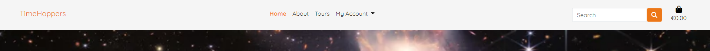

3. **Landing Page**
*   Free images from [The James Webb Space Telescope](https://webbtelescope.org/resource-gallery/images) were carefully chosen as background images.  Javascript is used to change these images change depending on the time of day the user visits the site.  With the use of Javascript, the landing page also contains a live digital clock.  Inspiration for this idea was taken from [Google's Momentum Extension](https://chrome.google.com/webstore/detail/momentum/laookkfknpbbblfpciffpaejjkokdgca).  These images and the clock were chosen as they are interesting, compliment the site's colour theme and are relevant to the theme of Time Travel.

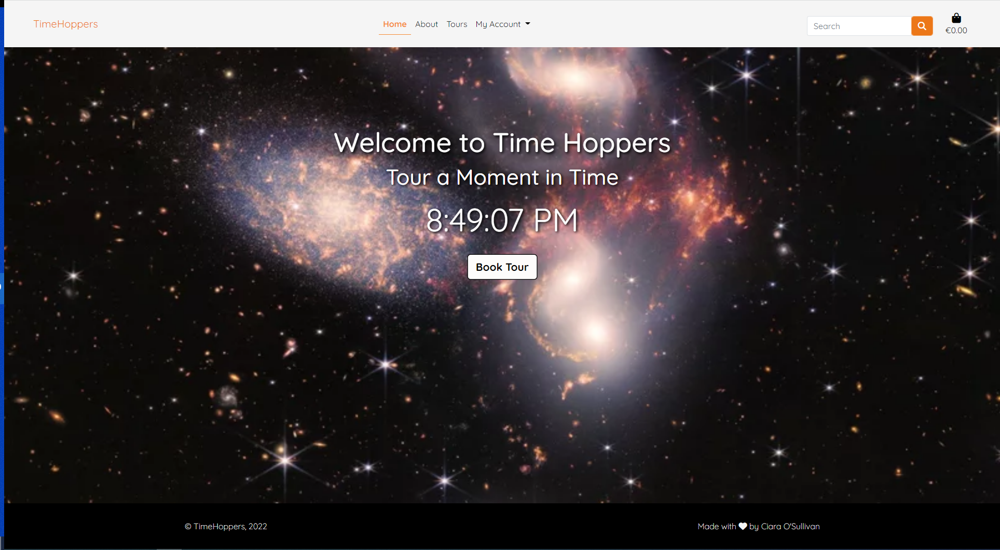

*   The landing page also contains the title of the website and its subtitle. A white font with a drop gray shadow was used for contrast for reading accessibility and consistancy with colours used in the header. CSS animation and keyframes was used as an effect to slowly fade the text in on page load.

*   A Book Tour button links to the list of tours section.  This button's aim is to invite the user to interact and encourages them to continue to view the list of tours on offer. The user can also access this tours list from the navigation bar but this button adds an extra feature incase the instinct to look to the navigation bar does not happen.

*   The explore button is also white and changes to orange on hover for contrast for reading accessibilty.

4. **About Us**
*   The About Us section contains important information the user needs to know about the site, its purpose, a summary of ordering and paying instructions and why create an account.

*   The about us page also contains a list of tour guides, their image, information and contact details for each.  This is to familiarise the user with the guides and allow for ease of contact.  Bootstrap 5 card was used with a shadow to create a 3D layered effect on the screen and the text colour used was black, grey and orange to keep consistancy throughout the site with the header and footer.

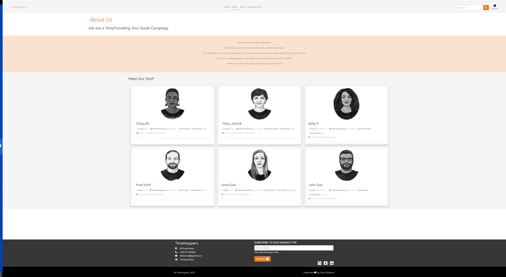

5. **Tour List View**
*   On the Tours page, Django’s generic class-based ListView was used to list all the tours on offer.

*   For each tour the list displays the title, how many reviews are associated with that particular tour, it's departure time, whether it is accessibility-friendly, the price and the tour's associated image.

*   The first 100 characters of the tour description is displayed by using |slice to give a very short snippet of what the project is about. As Sunmmernote is used for the admin user to add tours, the tours list uses |striptags to stop the html tags from Summernote displaying on the page and then escape HTML for safety using the |safe tag.

*   The tours are listed with the newest first and they are paginated after every 6. The pagination is designed to not only show the page numbers but also the first, previous, next and last page to make it easy for the user to navigate.

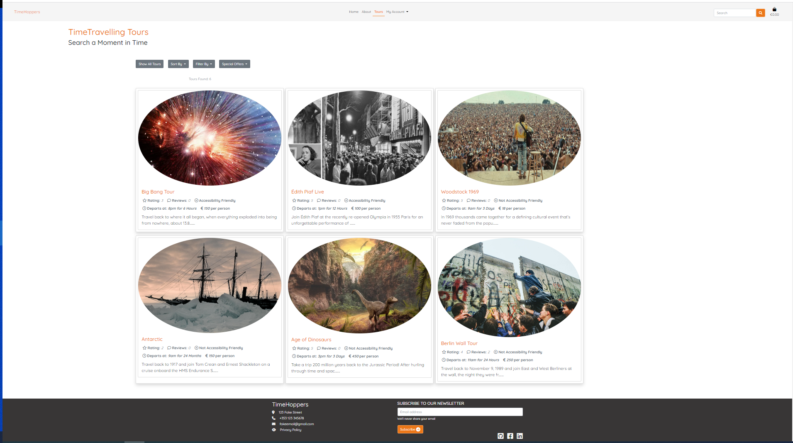

6. **Search, Order & Filter**

*   On the Tours List Page the user has the option to not only search but also there are drop down boxes for ordering by and filtering by.  This allows the user to easliy find the tour they wish to view.  The anount of tours found is also displayed and if no results are found the user is infromed of this and asked to search again.

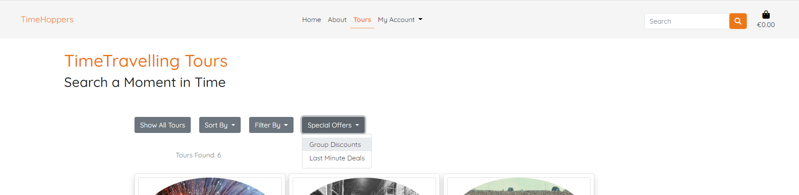

7. **Tour Detail View**

*   From the Tours List View, when the user clicks the title of the tour or it's image, they are taken to a separate page that shows this tour in detail. Django’s generic class-based DetailView was used to display each of the instances of the table in the database so that only that chosen tour and its related details will show on this page. Along with a Book Tour Button that takes them to the Booking Form for that tour.

*   For responsive Design the Tour's image is displayed fullscreen in the background on large screens but as a small rounded image above the card for mobile view.

*   Also, on each of these tour detail view pages the user can see any reviews related to the tour, the number of reviews listed, the name of the user who wrote the review, their profile picture and date posted. The reviews are displayed as oldest first to make it easy for the user to follow the thread of conversation. The reviews are paginated after every 6 reviews and just like the tour list page, the pagination shows not only the page numbers but first, previous, next and last to make navigation easy for the user.

*   If there are no reviews yet for a tour, a message will show, notifying the user of this and inviting them to be the first to add a review for the tour.

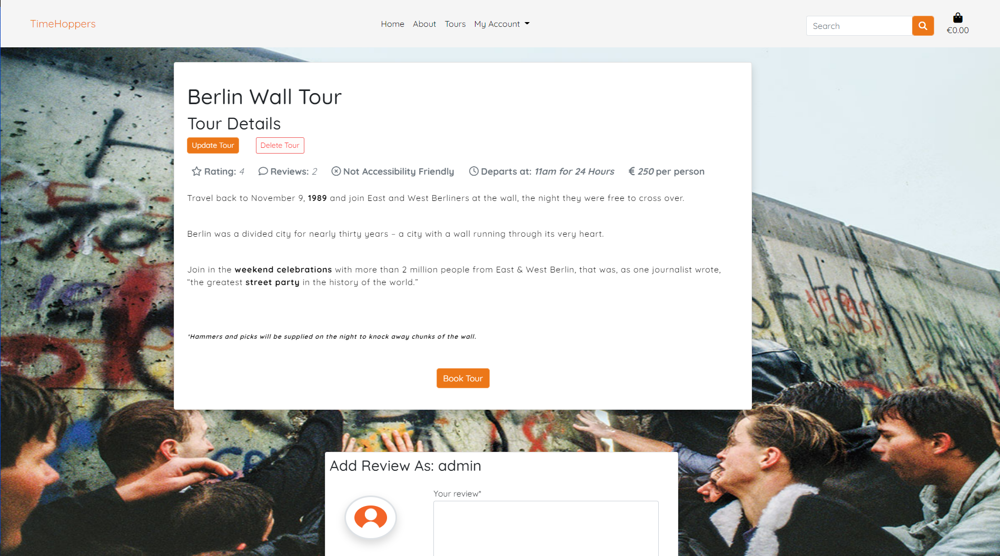

8. **Creating, Updating & Deleting a Review**

*   If the user is not signed in, then they will not have permission to post a review. If the user is not logged in and on the tour detail page, then they will see a message asking them to sign in if they want to add a review. The button then takes them to the sign in page.  After signing in, the user is then automatically taken back to that particular tour detail page to make navigation easy for the user. This is achieved by using ?next={{request.path}}. This adds a URL parameter next containing the address of the current page, to the end of the linked URL. After the user has successfully logged in, the views will use this "next" value to redirect the user back to the page where they first clicked the login link, which is the tour detail view page.

*   Once logged in then the user will see their profile picture and name beside a form. It notifies the user that they will be adding a review as their username. Once the user has written their review and clicked the submit button, they are alerted that their review was successfully added and are taken back to the tour detail page where they can view their review if they wish. Again, this is set up to help with ease of navigation for the user.

*   If the user is logged in they are presented with a form, their name and profile picture and asked to add a review.

*   If the user is logged in the option to update or delete their review is displayed beside any review they wrote.

*   If the user chooses to update, then they are presented with the review form, already prepopulated with their review so they can amend as needed and resubmit.

*   If the user decides to delete their review, they are taken to a separate page and asked if they are sure before deciding to permanently delete. This is to provide a safety net in case the user changes their mind or clicked the delete button by mistake.

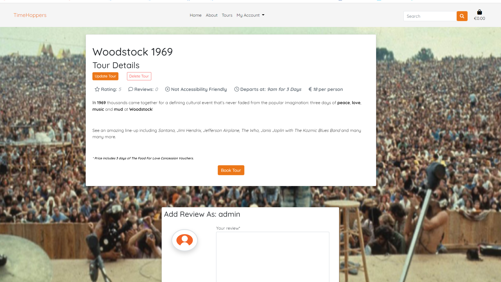

9. **Book Tour Form**

*   The users do not have to be signed in to book and purchase a tour.

*   Once the user has clicked the book tour button on the tour detail page they are taken to the Booking Form.

*   Here the short details of the tour are displayed again along with a Date Picker and a Quantity Form.  Javascript is used on the Date Picker so that the user cannot book a date in the past.  The Quantity Form allows the user to enter a digit from 1 onwards and both will display an error message to the user if nothing is entered.

*   Once the add to basket button is clicked a message is diplayed to alert the user the bookiing has been added to their basket and the basket icon in the Navigation Bar will be updated to display the new total price.

*   The user also has the option to go back to browse more tours.

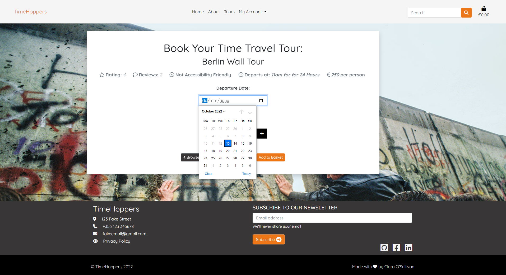

10. **Basket**

*   The user can access thir basket by clicking on the icon on the Navigation Bar.

*   The basket page is diplayed slightly differently for mobile view for responsive design alothough all the information remains the same.

*   The user has the option to update the quantity of tickets they want to purchase or delete the booking altogether.

*   Once the user is happy with the contents of their basket they can continue on to the Order From Page or they have the option to go back and browse more tours to add to their basket.

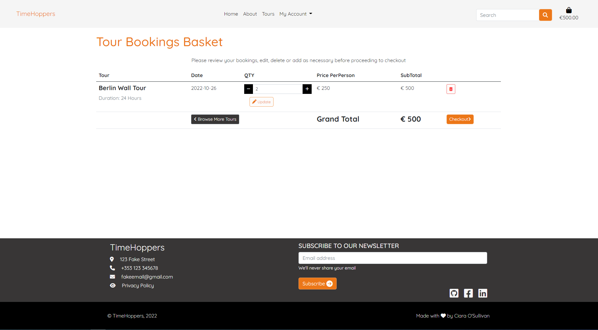

11. **Order From**

*   Once on the order form page the user has the option of filling in the order form and if they choose to sign in, the details they enter will be saved to their profile page or vice versa, so that their information will automaticlly populate the order form.

*   A summary of the booking is dsplayed on the booking page and Stripe is used as the method of payment.

*   The payment details section is taken directly from Stripe to capture the payment card information. As the Stripe payment system is not fully activated only the test card information can currently be utilised.

*   A stripe developer account was created at [Stripe.com](www.stripe.com) to gain access to the api keys required to run the payment processes.  The stripe public key, stripe secret key and stripe webhook key were inserted into the env.py file and the heroku config vars.  Stripe documentation was followed to impliment Stripe as the payment platform.

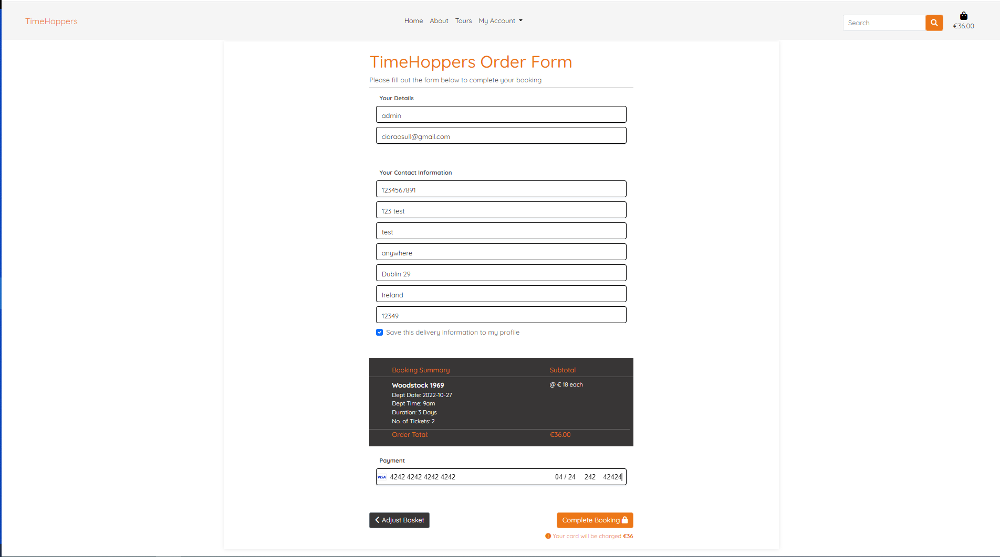

12. **Order Confirmation Page**

*   Once the payment is successful the user is taken tot he order confirmation page.  Here the user is given a summary of the order, their order number and informed that they have been emailed their tickets.

*   The user is then gven the option to view their profile or return to browse more tours.

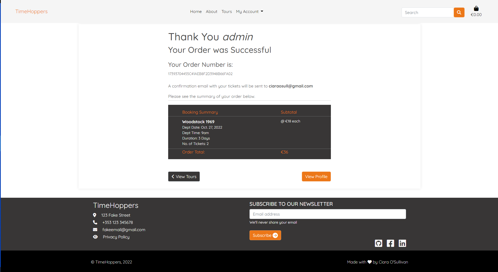

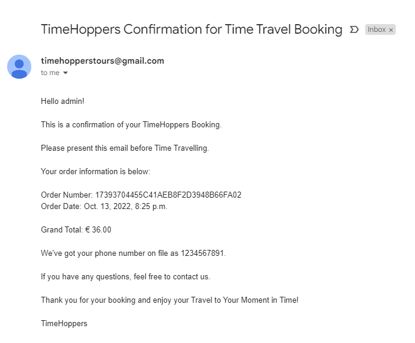

13. **Profile Page**

*   Once a user registers, they will have a profile page automatically created for them. The link to their profile page appears in the navigation bar once they are logged in. On this page the user can choose to update their profile information such as username, email address, home address and profile image. If no image is chosen, then a default profile image is provided.

*   The details saved here in the profile page are linked to the order form and will prepopulate the order form to make it easy for the user to only have to input or update their details in one place.

*   The Profile page also contains a table listing out the details of all the users purchased bookings.  This is to assist the user to have all their bookings in 1 place for ease.

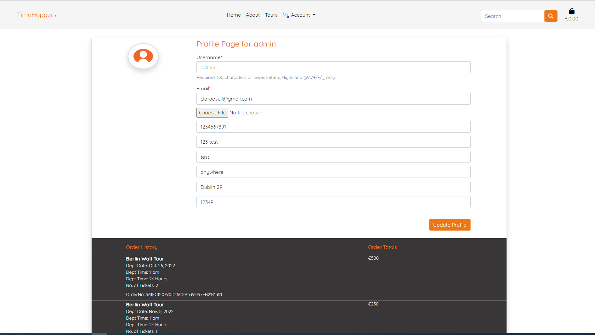

14. **Register, Sign In & Log Out**

As described in the future features section of this README, it is hoped that this project will be expanded to provide support for third-party (social) authentication via services like Github or Gmail. As Django does not support this automatically, allauth was installed and used to create the register, sign in and log out functionality, so the project will already have the foundations in place to expand on this functionality in the future.

At present to register, the user is required to provide an email address.  They are then emailed a verification link to ensure the email they have provided is correct and valid.

As previously described, once a user is logged in the navigation bar will change to display the different features the user has access to.

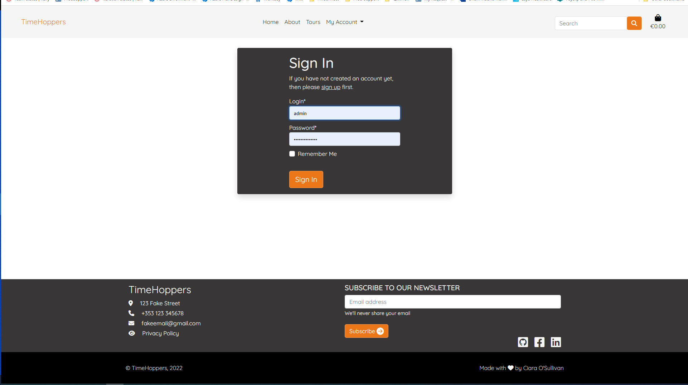

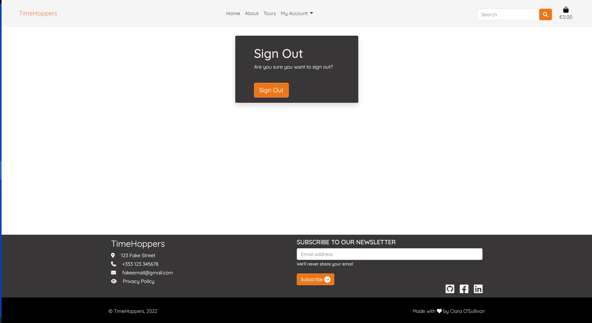

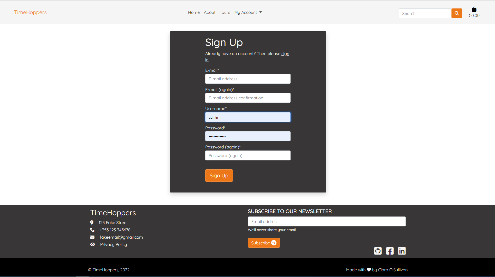

15. **Footer**

*   The Footer contains the Contact Us information. The background and font colours are kept consistant with the theme of the site.

*   The GitHub & LinkedIn icons from Font Awesome open in a new tab and take the user to the respective sites to connect.

*   The Footer also contains a copyright and the authours name.

*   Subscribe to Newsletter
    *   The user is given the option to enter the email address to subscribe to the Newsletter for the site.  If the email they enter has already been added the user will be informed that this email address already belongs to a subscriber.

    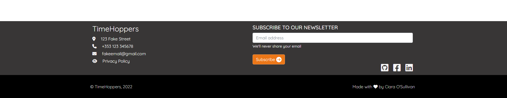

*   Privacy Policy
    *   A privacy policy is added to the site to inform users of how their information is used and stored.  Access to this page is by the Privacy Policy link found in the footer.

    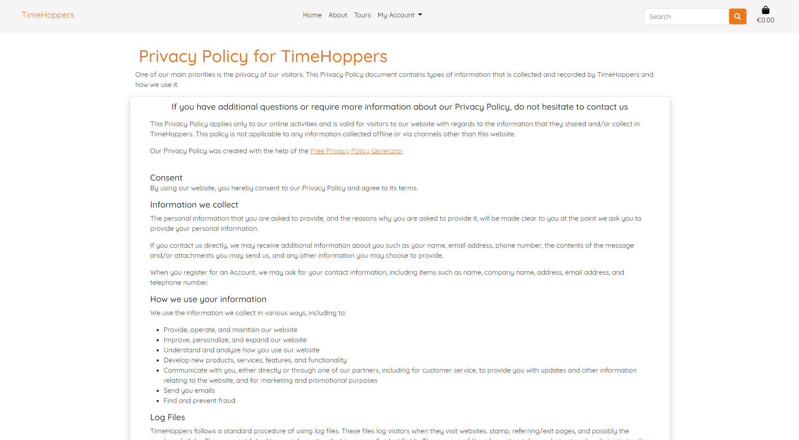

16. **Admin User**

A super user was created to allow access to the admin section of the website.  Once logged in as admin, the Admin Site link is displayed un Account in the Navigation Bar.

*   Add, Update & Delete Tours as Admin
    *   Once signed in, the admin user is given a link in the Navigation Bar under the Accounts section to Add Tour.  This link takes the user to a form where they can add details of a new tour to be added.  There is the option to choose an image, if not the default image will be used.

    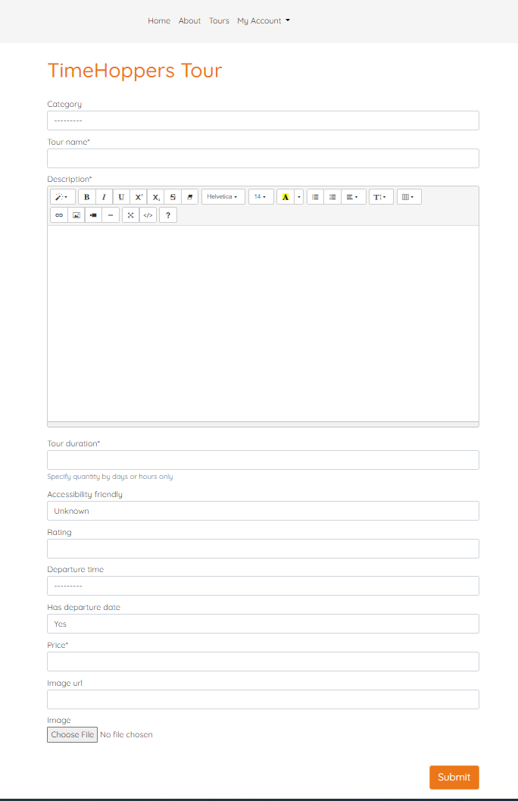

    *   Once signed in, the admin user is given the option on every Tour Detail Page to Update or Delete the chosen Tour.

    

*   Create & Email Newsletters to Subscribers
    *   Once signed in, the admin user is given a link in the Navigation Bar un the Accounts section to create and email a Newsletter.  This link takes the user to a form where they can add details to a Newsletter.  Once finsihed the admin can then send the Newsletter and it will be emailed to all the subscribers whose emails are in the database.

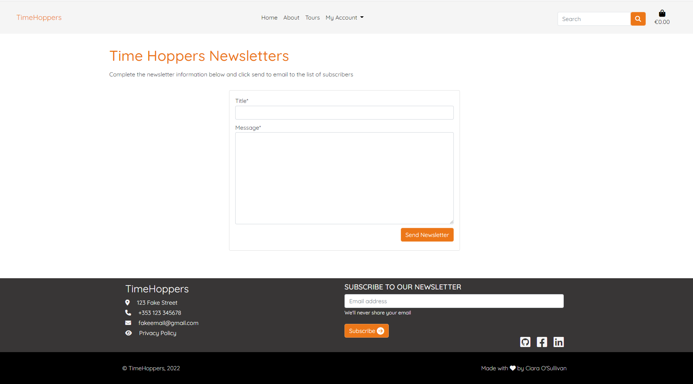

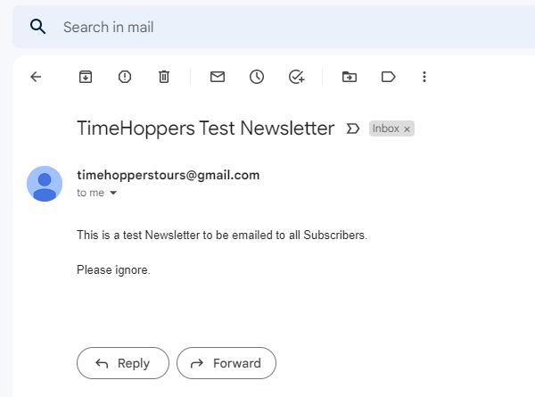

17. **Error Pages**

Custom Error Pages were created to support the professionalism design and ensure appropriate link was added back to the main site to guide users who come across these messages.

* 400 Bad Request - the server cannot process the request due to something that is perceived to be a user error (it may be incorrect or corrupt).
* 403 Page Forbidden - the user does not have permission to access this resource
* 404 Page Not Found - the user requested a page that is not available
* 500 Server Error - internal server error where there is a general problem with the website's server and not the fault of the user

### Features Left to Implement

*   Sign in with Social
*   Automatic login after registraion - given more time this feature could be implitmented by importing login from (django.contrib.auth)[https://docs.djangoproject.com/en/4.1/topics/auth/default/]
*   Email after subscribing to verify the email address
*   Subscribers - option to unsubscribe
*   Order list - option to delete orders from profile page
*   Wish List
*   Users can add rating or likes
*   Reset Password functionality
*   Accessibility Page - view & url already written, the template with the information just needs to be added
*   Basket mobile view does not automaticlly delete when 0 entered like the large screen view oes.  Javascript id's for both views need to be changed to be unique, however, once the user cicks the delete butoon this does delete the booking so the feature is still functioning.
*   Ability to report inappropriate reviews
*   The console seems to log that properties of 'style' are null.  This is coming from the Javascript placed on the Django messages for the user so that the messages will disappear after a few seconds.  The null value appears only in the console when no Django messages need to display.  Keeping the user in mind, a work around for this, given more time, would be to add an X close button on the message so the user can close the message themselves if it was an annoyance displaying before page refresh / reload.

### Interesting Bugs & Issues

*   One issue that took some considerable time to identify and resolve was using Summernote editor for the Newsletter message section and trying to email to a mailing list.  When Summernote was used, only one subscriber at a time could be emailed the Newsletter.  Once Summernote was removed and just a Django TextField used instead, this was accpeted and the Newsletter could be emailed to all subscribers at the same time.

## Design

### Data Model

[LucidCharts](www.lucidchart.com) was used to visualise the custom models for this project.  [AllAuth](https://django-allauth.readthedocs.io/en/latest/) was also used for the user authentication system.  This uses the built-in Django User Model.

The Profile model allows users who sign up to have a profile automatically created for them and the user can then update and change their profile information if they wish. One User has One Profile, so this is a One-to-One relationship with the User’s name acting as the Foreign Key to the User Model.

As each User and their Profile can have many Orders, this is represented using the One-to-Many relationship however each Order can only have one User. The Users Profile from the Order Model acts as the Foreign Key to the User Model.

Also, every Tour can have 0 or many Reviews and the tour acts as the Foreign Key to the Review & Tour Model. As only one User can be the author of any one review this is represented by the One-to-One relationship with the User Model and the author of the review is acting as the Foreign Key for the Reviews.

The Staff model is linked to the Tour Model as a Foreign Key to represent the tour that the staff member is the Tour Guide for.

The Categories are linked to the Tour Model as a Tour can only have 1 category but 1 category can be assigned to many tours.

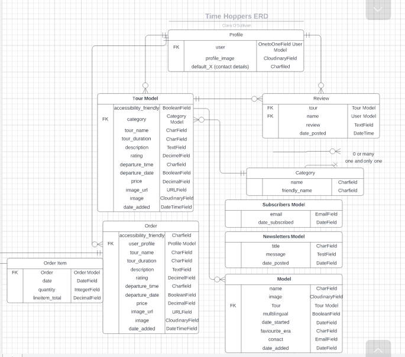

### Wireframes

After the design of the models [Balsamic Wireframes](www.balsamiq.com) were created to visualise the content the user sees and to design a positive UX (as described in more detail in the Features section).  A mobile first approach was used to design the site specifically for mobile use and then the design was altered slightly for desktop view.  [Bootstrap 5](https://getbootstrap.com/docs/5.0/getting-started/introduction/) was used with some customised styling to create a unique feel to the site.  [Font Awesome](https://fontawesome.com/) Icons were used throughout the site for reading accessibility also.  Below are some examples of the Wireframes created:

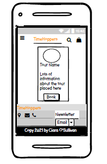

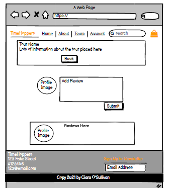

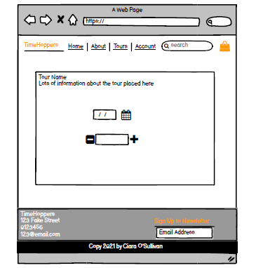

### Fonts
Fonts were imported from [Google Fonts](https://fonts.google.com/).
The fonts used were Quicksand and serif. Quicksand was chosen for its clear lettering and spacing for reading accessibility for the user.

### Colour Scheme

The colour scheme was chosen by using [Coolors](https://coolors.co/). The following palette was chosen for using on the fonts throughout the site due to high contrast for user reading accessibility:

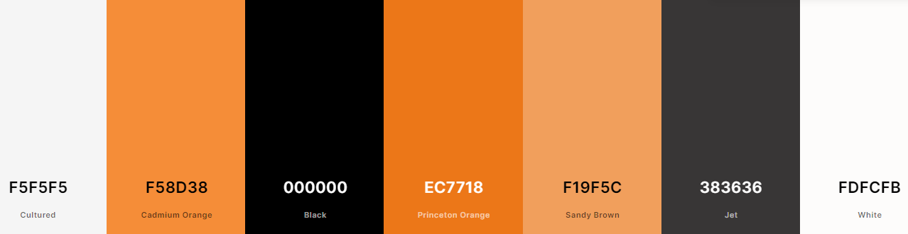

## Testing

During development, using flake8, errors or warnings were fixed as they appeared such as indentation errors, lines too long, or extra space issues. This helped keep the code clean and readable so other errors or bugs that arose were identified more easily.  Django automaticlaly created code with lines too long, such as those in the settings.py were not altered.  Any unnecessary Django automatically created folders and files were also deleted to keep the file system clear and easy to navigate.

Google Chrome's built-in Developer Tool was used to inspect page elements throughout the build and helped debug issues within the HTML code and CSS styles.

After deployment, all features were tested for responsive design on a laptop and mobile (Samsung Galaxy & iPhone 8). The site was sent to peers to check from their devices that all features functioned correctly and feedback on responsiveness and functionality was positive across all devices checked such as PC, Laptop, Tablets, and Mobiles (Android & IOS). The website was checked on Chrome, Firefox, and Edge.

The README.md was proofread and passed through Grammarly and all links were checked before final submission.

During development, after each User Story was matched to their corresponding feature (acceptance criteria) and manually tested. Manually testing each function was recorded in the commits as development progressed also but the following table tracks the final full manual test of the site after deployment:

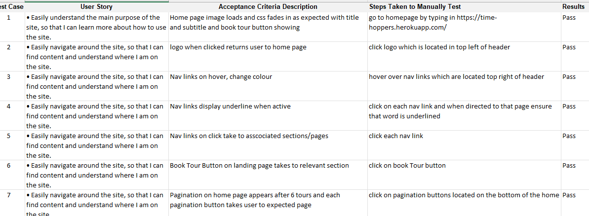

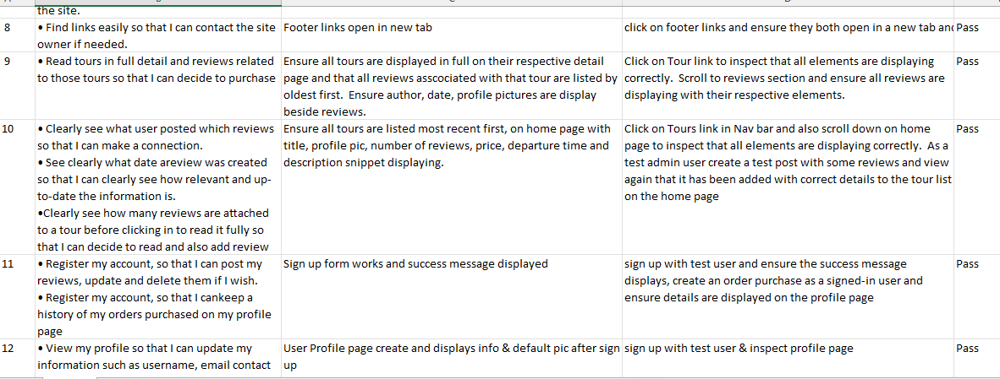

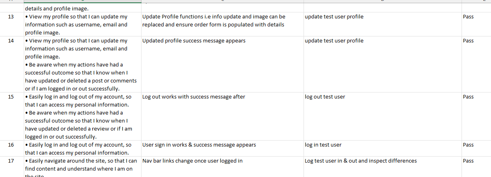

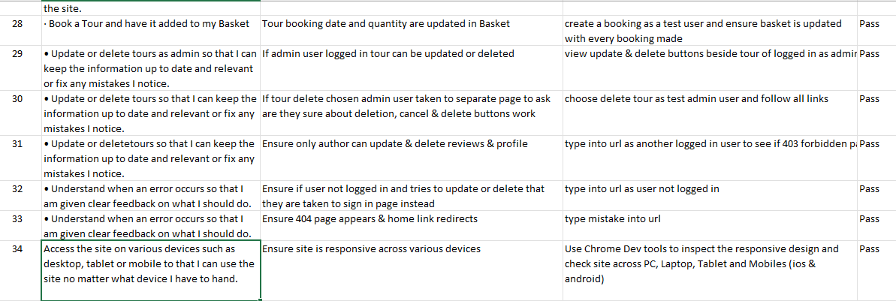

### Validator Testing

*   CSS stylesheet was run through the W3C CSS Validator and showed no errors.
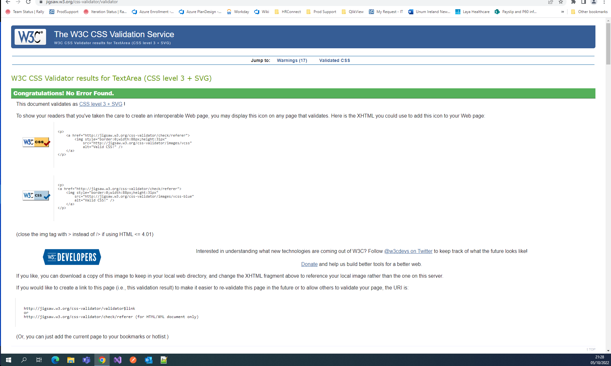

*   All html pages were run through the W3C HTML Validator and showed some minor missing/duplicate end tag errors, and these were fixed accordingly.
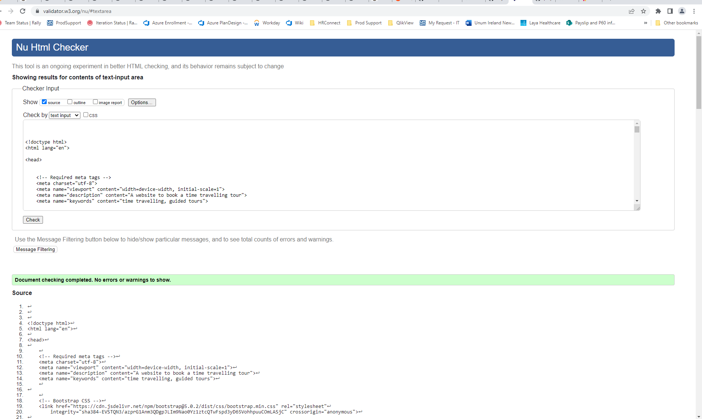

*   JSHint site was used to validate the JavaScript code. It returned errors with semi-colons missing, whcih were corrected.
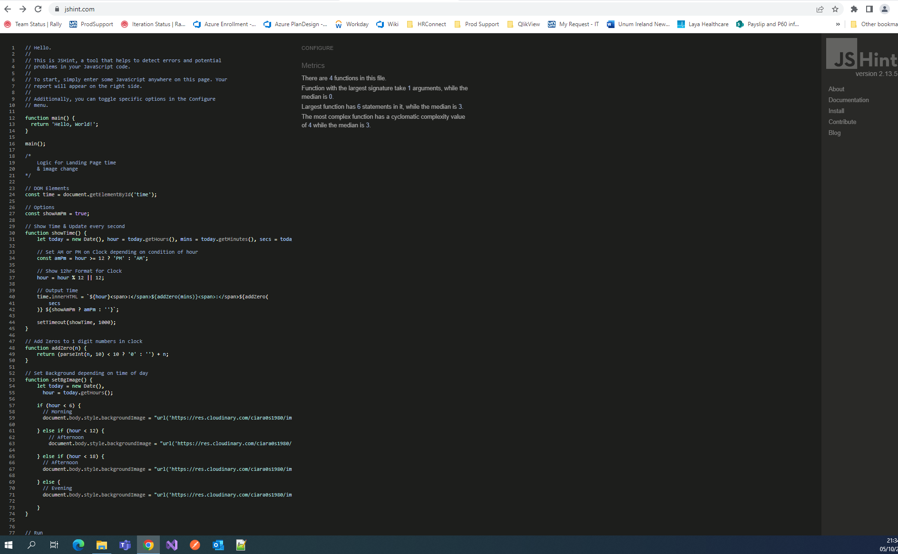
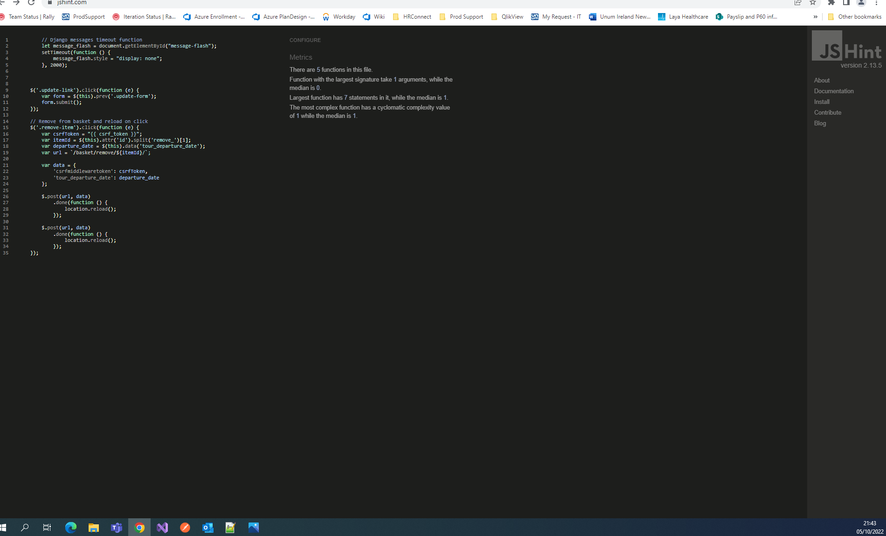

*   Lighthouse was used to check perfomance and accessiblitiy.  The chosen orange colour for the Logo etc. was not contrasting enough so a darker shade of this orange colour was chsoen for the text to stand out against the light grey backgroud.

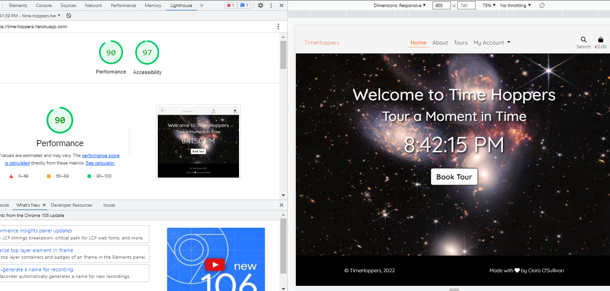

## Security

All SECRET access keys are stored safely in env.py file to prevent unwanted connections to the database and this was set up before the first push to Github.

Django’s setting DEBUG was set to False after development for deployment to prevent access to error screens revealing code or database entries.

Django allauth was used to set up user registration and Django’s LoginRequiredMixin and UserPassesTestMixin were used to ensure only signed in users and authors can edit / delete their own reviews etc.

Cross-Site Request Forgery (CSRF) tokens were used on all forms throughout this site to prevent valid requests to the backend server being created for malicious purposes.

## Web Marketing

Web marketing is the process of marketing a  business online, and it's a cost-effective way to reach people who are most interested in what a business has to offer. 

The following details the strategies used for this project for Web Marketing.

**Site Engine Optimisation**

An xml sitemap was created and added to the project's root directory.  This is a file that lists the website’s important page URLs, making sure that search engines can crawl, or navigate, through them. It also helps search engines understand the website structure, so can help speed up content discovery.

The robots.txt file was also created and added to the projects root directory.  This is a simple text file that tells search engines where they are not allowed to go on the website. It lists out any folders or files that will not be crawled or indexed by search engine spiders. Having this robots.txt  file shows that the site acknowledges that search  engines are allowed and that they  may have free access to it.  For this reason, search engines take the existence of this file as a sign of quality, 
and so should improve the SEO ranking.

The final step for working with a sitemap  and robots files can only be implemented for web applications that have a DNS certificate.  As this is a fictitious website for project purposes only no further action will be taken.

Key words were researched to determine which were most important to the sites potential customers.  Keyword research is the process of finding and analyzing search terms that people enter into search engines, with the goal of using that data for SEO or general web marketing.   The metadata section along with HTML elements like headings,  
main, section, header, footer, the strong and emphasis tags and alt descriptions on images were all utilised to enter the identified key words for better SEO.  Content Stuffing was avoided and keywords were only utilised if they fit within the flow of the content.

Rel attributes such as noopener and noreferrer were also used on any external links.

*   Noopener is mandatory for any links that have the 'target="_blank"' attribute. This prevents the new page having any access to the tab/session that opened it, preventing common phishing attack vectors.

*   Noreferrer is the older version of 'noopener' and does the same thing, but prevents the site that is being linked to from knowing that you ever linked to it in the first place, so it looks to SEOs that it's a direct link to the site.

**Content Marketing**

Content marketing comes in many forms, including blog posts, videos, podcasts, webinars and newsletters.  This site gives the users the option to subscribe to the sites Newsletter in an effort to attract new customers and also retain existing customers by keeping them up to date on special offers or new tours.  One disadvantage to this could be that the emailed Newsletter will be seen as spam and not reach the user.

Social media marketing was also chosen for this project as it suits small businesses that don’t have big budgets because it is free.  It is hoped that this would build up a personal connection to the clients, build awareness and spread the brand.  One disadvantage of this is that social media marketing needs to be engaged with and updated on a regular and consistant basis and so can be time consuming.  A mock Facebook WireFrame was created so draft the layout of the page that will be used for social media marketing.

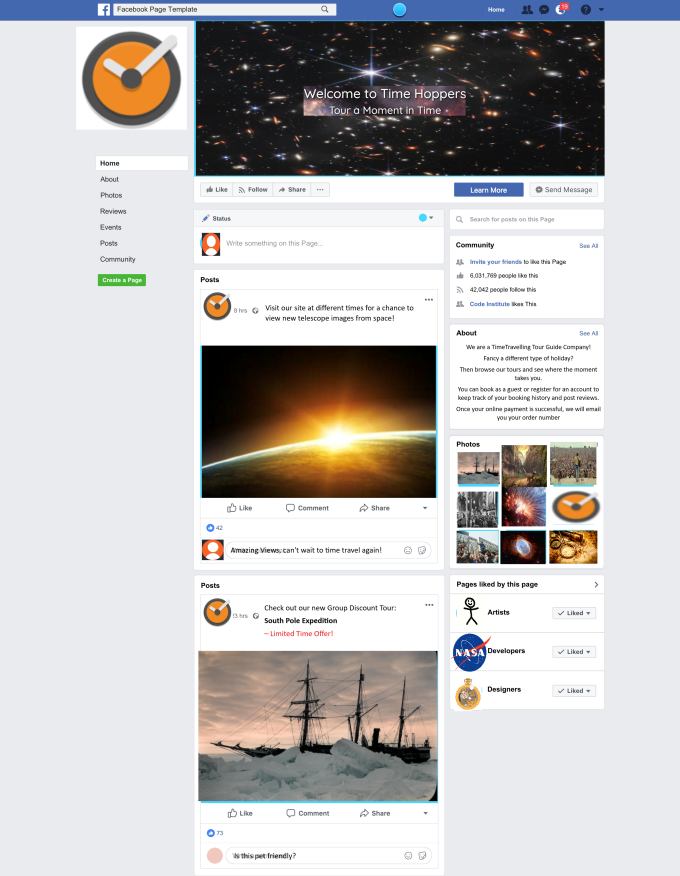

## GDPR Considerations

*   This website contains a Privacy Policy that users can access from the footer.  The purpose of this privacy policy is to be transparent and inform users about how their data is being collected and processed.

*    Data collected on this site is only being used for the purpose it was collected for from the user. 

*   Users are also informed beside the input box for entering their email address to subscribe that this site will never share their email address with anyone.

*   As the users personal data is not being used, there is no need for this project to ask the users for consent to share their data once they are completing the order form or the profile page form with their details.  If this information was being shared then an unticked check box would need to be added at these points to inform the user and ask for their consent.

*   This website does use cookies to collect data and so there is no need for users to be able to easily consent or reject cookies as their usage is not being tracked.

## Technologies Used

*   Languages:
    *   Python: used to develop the server-side
    *   HTML: the markup language used to create the web pages
    *   CSS: the styling language used to add custom styling

*   Frameworks and libraries:
    *   Django: python framework used to create all the backend logic
    *   Bootstrap5: CSS Framework for developing responsiveness and mobile-first
    *   Django-allauth: authentication library used to create the user accounts
    *   Django-Pandas: used to reaframe to create a list of subscribers to email 

*   Databases:
    *   SQLite: used as the database during development
    *   PostgreSQL: the database used to store all the data on deployment

*   Other tools:
    *   Balsamiq Wireframes: used to create the wireframes for design
    *   Chrome DevTools: used to debug the website
    *   Crispy Forms: used to manage Django Forms
    *   Cloudinary: the image hosting service used to upload images
    *   Coolors: used to make the colour palette
    *   Stripe: payment platform
    *   Font Awesome: used to create the icons
    *   Github Projects: used to track the progress of the project
    *   Git: the version control system
    *   GitHub: used to host the source code
    *   GitPod: the IDE used
    *   Heroku: the hosting service
    *   LucidCharts: used to create the ERD data model design
    *   Microsoft Paint 3D: used to create and manipulate images
    *   Pip3: the package manager used to install the dependencies
    *   Psycopg2: the database driver used to connect to the database
    *   Summernote: to allow for more options for admin to create the details of tours

## Deployment

The site was deployed via Heroku.
1.  Log in to Heroku or create an account if required.
2.  Then, click the button labelled New from the dashboard in the top right corner and from the drop-down menu select Create New App.  You must enter a unique app name
3.  Next, select your region.
4.  Click on the Create App button.
5.  In your app go to Resources tab and add a Heroku Postgres database.
6.  The next page you will see is the project’s Deploy Tab. Click on the Settings Tab and scroll down to Config Vars and enter:
    *   DATABASE_URL = the URL of your heroku postgres database
    *   SECRET_KEY = a secret key for your app.
    *   PORT = 8000
    *   DISABLE_COLLECTSTATIC = 1 during development and remove when deploying to production
    *   Also include keys for Cloudinary and Stripe if applicable.
7.  Scroll to the top of the page and now choose the Deploy tab.
8.  Select Github as the deployment method.
9.  Confirm you want to connect to GitHub.
10. Search for the repository name and click the connect button.
11. Scroll to the bottom of the deploy page and select preferred deployment type:
12. Click either Enable Automatic Deploys for automatic deployment when you push updates to Github.
13. Select the correct branch for deployment from the drop-down menu and click Deploy Branch for manual deployment.

NB: Ensure in Django settings, DEBUG is False, create a Procfile and save database and secret key to env.py.

### Version Control

Git was used as the version control software. Commands such as git add ., git status, git commit and git push were used to add, save, stage and push the code to the GitHub repository where the source code is stored.

### Cloning

To clone this repository from GitHub to a local computer to make it easier to fix merge conflicts, add or remove files, and push larger commits or contribute use the following steps:

1.  On GitHub, navigate to the main page of the repository.

2.  Above the list of files, click Code.

3.  Click Use GitHub CLI, then the copy icon.

4.  Open Git Bash and change the current working directory to the location where you want the cloned directory.

5.  Type git clone, and then paste the URL that was copied from step 3 above.

6. Press Enter to create the local clone.

### Forking
A fork is a copy of a repository. Forking a repository allows you to freely experiment with changes without affecting the original project.

To fork this project, go to the top left of the repository, where you see the Fork Icon and click Fork.  This will create a copy of the repository for you.

## Credits
### Content
*   [Bootstrap 5 Classes Cheatsheet](https://www.studytonight.com/bootstrap/how-to-align-bootstrap-5-navbar-items-to-the-right)

*   [Bootstrap 5 Move Nav Links Right](https://www.studytonight.com/bootstrap/how-to-align-bootstrap-5-navbar-items-to-the-right)

*   [Bootstrap Footer Ideas](https://mdbootstrap.com/docs/standard/navigation/footer/): a mix of these were used with customised styling

*   [Jinja Docs](https://jinja.palletsprojects.com/en/3.1.x/templates/#list-of-builtin-filters)

*   [Django Docs](https://docs.djangoproject.com/en/4.0/)

*   [Django Allauth](https://django-allauth.readthedocs.io/en/latest/)

*   [GeeksforGeeks](https://www.geeksforgeeks.org/createview-class-based-views-django/) class based views

*   [Django Docs Pagination](https://docs.djangoproject.com/en/2.2/topics/pagination/#using-paginator-in-a-view)

*   [Cloudinary Field in Django](https://www.section.io/engineering-education/uploading-images-to-cloudinary-from-django-application/)

*   [Summernote in Django](https://djangocentral.com/integrating-summernote-in-django/)

*   [Stripe Documentation](https://stripe.com/docs)

*   Code Institute - Tutorial Videos (For Bag & Order Apps functionality)

## Acknowledgements

This project was made possible due to the help, advice and support of my Code Institue Tutor Kasia, my Mentor Daisy and all the lovely people on the Code Institue Slack community.
